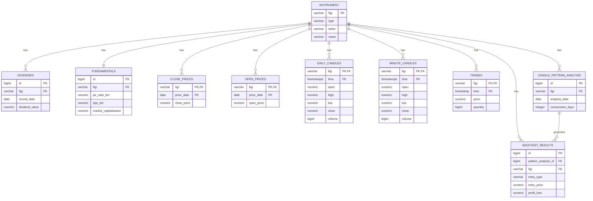

# ERD диаграмма базы данных InvestmentDataLoaderService

## Диаграмма сущностей и связей

## Упрощенная диаграмма (основные сущности)

## Диаграмма по категориям данных

## Легенда

### Обозначения связей

- `||--o{` - Один ко многим (1:N), где "много" может быть нулем
- `||--||` - Один к одному (1:1), где связь обязательна
- `}o--o{` - Многие ко многим (N:M)

### Обозначения ключей

- `PK` - Primary Key (Первичный ключ)
- `FK` - Foreign Key (Внешний ключ, логический)
- Составные ключи обозначены как `PK,FK` для полей, входящих в составной ключ

### Примечания

1. **Логические связи:** В базе данных не определены явные FOREIGN KEY constraints. Все связи реализованы на уровне приложения через использование FIGI.

2. **Партиционирование:** Таблицы `close_prices`, `open_prices`, `daily_candles`, `minute_candles`, `last_prices`, `trades` партиционированы по времени, что не отражено на диаграмме.

3. **Упрощения:** 
   - На полной диаграмме показаны только ключевые атрибуты
   - Многие вычисляемые поля (например, `price_change`, `candle_type`) не показаны
   - Служебные поля (`created_at`, `updated_at`) показаны только в первой диаграмме

4. **Типы инструментов:** SHARES, FUTURES, INDICATIVES являются разными типами инструментов, но имеют одинаковые связи с другими сущностями через FIGI.
